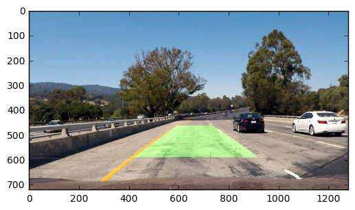

## Advanced Lane Finding

This Udacity project uses computer vision to label the lanes in a driving video, calculate the curvature of the lane, and estimate the distance of the vehicle from the center of the lane. The rest of the project writeup can be accessed via [PDF](P1.pdf) or [Jupyter notebook.](P1.ipynb)

Steps
* Compute the camera calibration matrix and distortion coefficients given a set of chessboard images.
* Apply the distortion correction to the raw image.  
* Use color transforms, gradients, etc., to create a thresholded binary image.
* Apply a perspective transform to rectify binary image ("birds-eye view"). 
* Detect lane pixels and fit to find lane boundary.
* Determine curvature of the lane and vehicle position with respect to center.
* Warp the detected lane boundaries back onto the original image.
* Output visual display of the lane boundaries and numerical estimation of lane curvature and vehicle position.

---

